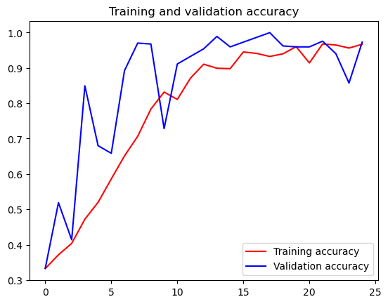

```python
import os
import zipfile

local_zip = 'D:/software/rps.zip'
zip_ref = zipfile.ZipFile(local_zip, 'r')
zip_ref.extractall('D:/software/')
zip_ref.close()

local_zip = 'D:/software/rps-test-set.zip'
zip_ref = zipfile.ZipFile(local_zip, 'r')
zip_ref.extractall('D:/software/')
zip_ref.close()

```


```python
! pip install tensorflow -i https://mirrors.aliyun.com/pypi/simple

```

    Looking in indexes: https://mirrors.aliyun.com/pypi/simple
    Collecting tensorflow
      Downloading https://mirrors.aliyun.com/pypi/packages/cd/28/d60804f272dfe07c7e5334899abb6af61f6c7f3f7e68c1faf96780988b50/tensorflow-2.12.0-cp310-cp310-win_amd64.whl (1.9 kB)
    Collecting tensorflow-intel==2.12.0
      Downloading https://mirrors.aliyun.com/pypi/packages/94/b4/f9fe2805899492ec3a38e6846ebe6a402a398e892d573af29f45c6a2a838/tensorflow_intel-2.12.0-cp310-cp310-win_amd64.whl (272.8 MB)
         -------------------------------------- 272.8/272.8 MB 2.4 MB/s eta 0:00:00
    Requirement already satisfied: h5py>=2.9.0 in d:\software\a\lib\site-packages (from tensorflow-intel==2.12.0->tensorflow) (3.7.0)
    Requirement already satisfied: six>=1.12.0 in d:\software\a\lib\site-packages (from tensorflow-intel==2.12.0->tensorflow) (1.16.0)
    Collecting gast<=0.4.0,>=0.2.1
      Downloading https://mirrors.aliyun.com/pypi/packages/b6/48/583c032b79ae5b3daa02225a675aeb673e58d2cb698e78510feceb11958c/gast-0.4.0-py3-none-any.whl (9.8 kB)
    Collecting keras<2.13,>=2.12.0
      Downloading https://mirrors.aliyun.com/pypi/packages/d5/80/34e55d7e3ed9cf18020929460f969de1bf82cf2f509c639b358ae2b25618/keras-2.12.0-py2.py3-none-any.whl (1.7 MB)
         ---------------------------------------- 1.7/1.7 MB 4.0 MB/s eta 0:00:00
    Requirement already satisfied: numpy<1.24,>=1.22 in d:\software\a\lib\site-packages (from tensorflow-intel==2.12.0->tensorflow) (1.23.5)
    Collecting opt-einsum>=2.3.2
      Downloading https://mirrors.aliyun.com/pypi/packages/bc/19/404708a7e54ad2798907210462fd950c3442ea51acc8790f3da48d2bee8b/opt_einsum-3.3.0-py3-none-any.whl (65 kB)
         ---------------------------------------- 65.5/65.5 kB ? eta 0:00:00
    Collecting grpcio<2.0,>=1.24.3
      Downloading https://mirrors.aliyun.com/pypi/packages/31/b5/df08a25aedb5c39b91a190b59c685f2d840ec7589e584f2d2173d160c833/grpcio-1.54.2-cp310-cp310-win_amd64.whl (4.1 MB)
         ---------------------------------------- 4.1/4.1 MB 2.9 MB/s eta 0:00:00
    Collecting libclang>=13.0.0
      Downloading https://mirrors.aliyun.com/pypi/packages/49/c5/265da99011dbe91cb18cba88e14397bddf8a286512866b8ffe83bc17e58b/libclang-16.0.0-py2.py3-none-win_amd64.whl (24.4 MB)
         ---------------------------------------- 24.4/24.4 MB 2.8 MB/s eta 0:00:00
    Collecting flatbuffers>=2.0
      Downloading https://mirrors.aliyun.com/pypi/packages/6f/12/d5c79ee252793ffe845d58a913197bfa02ae9a0b5c9bc3dc4b58d477b9e7/flatbuffers-23.5.26-py2.py3-none-any.whl (26 kB)
    Requirement already satisfied: packaging in d:\software\a\lib\site-packages (from tensorflow-intel==2.12.0->tensorflow) (22.0)
    Collecting absl-py>=1.0.0
      Downloading https://mirrors.aliyun.com/pypi/packages/dd/87/de5c32fa1b1c6c3305d576e299801d8655c175ca9557019906247b994331/absl_py-1.4.0-py3-none-any.whl (126 kB)
         -------------------------------------- 126.5/126.5 kB 3.8 MB/s eta 0:00:00
    Requirement already satisfied: wrapt<1.15,>=1.11.0 in d:\software\a\lib\site-packages (from tensorflow-intel==2.12.0->tensorflow) (1.14.1)
    Collecting protobuf!=4.21.0,!=4.21.1,!=4.21.2,!=4.21.3,!=4.21.4,!=4.21.5,<5.0.0dev,>=3.20.3
      Downloading https://mirrors.aliyun.com/pypi/packages/e7/ed/7472101221493605af740238fa72bd10c9965e05c50b3ef7904c7cad712c/protobuf-4.23.2-cp310-abi3-win_amd64.whl (422 kB)
         -------------------------------------- 422.5/422.5 kB 6.5 MB/s eta 0:00:00
    Requirement already satisfied: typing-extensions>=3.6.6 in d:\software\a\lib\site-packages (from tensorflow-intel==2.12.0->tensorflow) (4.4.0)
    Collecting tensorflow-io-gcs-filesystem>=0.23.1
      Downloading https://mirrors.aliyun.com/pypi/packages/78/51/437068ed6b44162d54addb8ac0ddfe9e406d07ac6f9c8a6cf96869ec2262/tensorflow_io_gcs_filesystem-0.31.0-cp310-cp310-win_amd64.whl (1.5 MB)
         ---------------------------------------- 1.5/1.5 MB 5.3 MB/s eta 0:00:00
    Collecting astunparse>=1.6.0
      Downloading https://mirrors.aliyun.com/pypi/packages/2b/03/13dde6512ad7b4557eb792fbcf0c653af6076b81e5941d36ec61f7ce6028/astunparse-1.6.3-py2.py3-none-any.whl (12 kB)
    Requirement already satisfied: setuptools in d:\software\a\lib\site-packages (from tensorflow-intel==2.12.0->tensorflow) (65.6.3)
    Collecting termcolor>=1.1.0
      Downloading https://mirrors.aliyun.com/pypi/packages/67/e1/434566ffce04448192369c1a282931cf4ae593e91907558eaecd2e9f2801/termcolor-2.3.0-py3-none-any.whl (6.9 kB)
    Collecting tensorboard<2.13,>=2.12
      Downloading https://mirrors.aliyun.com/pypi/packages/32/09/86e2ef3b4f4ec04bde0eca499325f291ae6b3313381d0666ee20b5b80c73/tensorboard-2.12.3-py3-none-any.whl (5.6 MB)
         ---------------------------------------- 5.6/5.6 MB 3.7 MB/s eta 0:00:00
    Collecting google-pasta>=0.1.1
      Downloading https://mirrors.aliyun.com/pypi/packages/a3/de/c648ef6835192e6e2cc03f40b19eeda4382c49b5bafb43d88b931c4c74ac/google_pasta-0.2.0-py3-none-any.whl (57 kB)
         ---------------------------------------- 57.5/57.5 kB 3.0 MB/s eta 0:00:00
    Collecting jax>=0.3.15
      Downloading https://mirrors.aliyun.com/pypi/packages/97/7f/f0ba64f1aedf032cf1d376fa85275a4c7979aefba7ca663432f5d93488d2/jax-0.4.11.tar.gz (1.3 MB)
         ---------------------------------------- 1.3/1.3 MB 4.1 MB/s eta 0:00:00
      Installing build dependencies: started
      Installing build dependencies: finished with status 'done'
      Getting requirements to build wheel: started
      Getting requirements to build wheel: finished with status 'done'
      Preparing metadata (pyproject.toml): started
      Preparing metadata (pyproject.toml): finished with status 'done'
    Collecting tensorflow-estimator<2.13,>=2.12.0
      Downloading https://mirrors.aliyun.com/pypi/packages/d1/e1/c3596da404e2c47561a2bb392397208925e65be6f61bd3081e630371d5e8/tensorflow_estimator-2.12.0-py2.py3-none-any.whl (440 kB)
         -------------------------------------- 440.7/440.7 kB 3.1 MB/s eta 0:00:00
    Requirement already satisfied: wheel<1.0,>=0.23.0 in d:\software\a\lib\site-packages (from astunparse>=1.6.0->tensorflow-intel==2.12.0->tensorflow) (0.38.4)
    Requirement already satisfied: scipy>=1.7 in d:\software\a\lib\site-packages (from jax>=0.3.15->tensorflow-intel==2.12.0->tensorflow) (1.10.0)
    Collecting ml-dtypes>=0.1.0
      Downloading https://mirrors.aliyun.com/pypi/packages/55/51/c430b4f5f4a6df00aa41c1ee195e179489565e61cfad559506ca7442ce67/ml_dtypes-0.2.0-cp310-cp310-win_amd64.whl (938 kB)
         -------------------------------------- 938.6/938.6 kB 2.1 MB/s eta 0:00:00
    Collecting google-auth<3,>=1.6.3
      Downloading https://mirrors.aliyun.com/pypi/packages/ec/9d/54ef08992423e0f569b516fd3bc01a2b3793bc66e11650c407e627794f42/google_auth-2.19.1-py2.py3-none-any.whl (181 kB)
         -------------------------------------- 181.3/181.3 kB 3.7 MB/s eta 0:00:00
    Collecting google-auth-oauthlib<1.1,>=0.5
      Downloading https://mirrors.aliyun.com/pypi/packages/4a/07/8d9a8186e6768b55dfffeb57c719bc03770cf8a970a074616ae6f9e26a57/google_auth_oauthlib-1.0.0-py2.py3-none-any.whl (18 kB)
    Collecting tensorboard-data-server<0.8.0,>=0.7.0
      Downloading https://mirrors.aliyun.com/pypi/packages/9d/cc/6f07c0043b44b3c3879ecfec1b8a450b6f5e3f8dccfedc9f5f1bc2c650e6/tensorboard_data_server-0.7.0-py3-none-any.whl (2.4 kB)
    Requirement already satisfied: requests<3,>=2.21.0 in d:\software\a\lib\site-packages (from tensorboard<2.13,>=2.12->tensorflow-intel==2.12.0->tensorflow) (2.28.1)
    Requirement already satisfied: werkzeug>=1.0.1 in d:\software\a\lib\site-packages (from tensorboard<2.13,>=2.12->tensorflow-intel==2.12.0->tensorflow) (2.2.2)
    Requirement already satisfied: markdown>=2.6.8 in d:\software\a\lib\site-packages (from tensorboard<2.13,>=2.12->tensorflow-intel==2.12.0->tensorflow) (3.4.1)
    Requirement already satisfied: pyasn1-modules>=0.2.1 in d:\software\a\lib\site-packages (from google-auth<3,>=1.6.3->tensorboard<2.13,>=2.12->tensorflow-intel==2.12.0->tensorflow) (0.2.8)
    Requirement already satisfied: urllib3<2.0 in d:\software\a\lib\site-packages (from google-auth<3,>=1.6.3->tensorboard<2.13,>=2.12->tensorflow-intel==2.12.0->tensorflow) (1.26.14)
    Collecting cachetools<6.0,>=2.0.0
      Downloading https://mirrors.aliyun.com/pypi/packages/a9/c9/c8a7710f2cedcb1db9224fdd4d8307c9e48cbddc46c18b515fefc0f1abbe/cachetools-5.3.1-py3-none-any.whl (9.3 kB)
    Collecting rsa<5,>=3.1.4
      Downloading https://mirrors.aliyun.com/pypi/packages/49/97/fa78e3d2f65c02c8e1268b9aba606569fe97f6c8f7c2d74394553347c145/rsa-4.9-py3-none-any.whl (34 kB)
    Collecting requests-oauthlib>=0.7.0
      Downloading https://mirrors.aliyun.com/pypi/packages/6f/bb/5deac77a9af870143c684ab46a7934038a53eb4aa975bc0687ed6ca2c610/requests_oauthlib-1.3.1-py2.py3-none-any.whl (23 kB)
    Requirement already satisfied: certifi>=2017.4.17 in d:\software\a\lib\site-packages (from requests<3,>=2.21.0->tensorboard<2.13,>=2.12->tensorflow-intel==2.12.0->tensorflow) (2022.12.7)
    Requirement already satisfied: idna<4,>=2.5 in d:\software\a\lib\site-packages (from requests<3,>=2.21.0->tensorboard<2.13,>=2.12->tensorflow-intel==2.12.0->tensorflow) (3.4)
    Requirement already satisfied: charset-normalizer<3,>=2 in d:\software\a\lib\site-packages (from requests<3,>=2.21.0->tensorboard<2.13,>=2.12->tensorflow-intel==2.12.0->tensorflow) (2.0.4)
    Requirement already satisfied: MarkupSafe>=2.1.1 in d:\software\a\lib\site-packages (from werkzeug>=1.0.1->tensorboard<2.13,>=2.12->tensorflow-intel==2.12.0->tensorflow) (2.1.1)
    Requirement already satisfied: pyasn1<0.5.0,>=0.4.6 in d:\software\a\lib\site-packages (from pyasn1-modules>=0.2.1->google-auth<3,>=1.6.3->tensorboard<2.13,>=2.12->tensorflow-intel==2.12.0->tensorflow) (0.4.8)
    Collecting oauthlib>=3.0.0
      Downloading https://mirrors.aliyun.com/pypi/packages/7e/80/cab10959dc1faead58dc8384a781dfbf93cb4d33d50988f7a69f1b7c9bbe/oauthlib-3.2.2-py3-none-any.whl (151 kB)
         ---------------------------------------- 151.7/151.7 kB ? eta 0:00:00
    Building wheels for collected packages: jax
      Building wheel for jax (pyproject.toml): started
      Building wheel for jax (pyproject.toml): finished with status 'done'
      Created wheel for jax: filename=jax-0.4.11-py3-none-any.whl size=1487992 sha256=8efc7edb418b268e58b0fe97fd1855127a4485f981a45bed47526cff722970bf
      Stored in directory: c:\users\linruihang\appdata\local\pip\cache\wheels\5e\a3\3a\79332731d5946b90edc0ca337fac64ede4e61b11fae08fb1fe
    Successfully built jax
    Installing collected packages: libclang, flatbuffers, termcolor, tensorflow-io-gcs-filesystem, tensorflow-estimator, tensorboard-data-server, rsa, protobuf, opt-einsum, oauthlib, ml-dtypes, keras, grpcio, google-pasta, gast, cachetools, astunparse, absl-py, requests-oauthlib, jax, google-auth, google-auth-oauthlib, tensorboard, tensorflow-intel, tensorflow
    Successfully installed absl-py-1.4.0 astunparse-1.6.3 cachetools-5.3.1 flatbuffers-23.5.26 gast-0.4.0 google-auth-2.19.1 google-auth-oauthlib-1.0.0 google-pasta-0.2.0 grpcio-1.54.2 jax-0.4.11 keras-2.12.0 libclang-16.0.0 ml-dtypes-0.2.0 oauthlib-3.2.2 opt-einsum-3.3.0 protobuf-4.23.2 requests-oauthlib-1.3.1 rsa-4.9 tensorboard-2.12.3 tensorboard-data-server-0.7.0 tensorflow-2.12.0 tensorflow-estimator-2.12.0 tensorflow-intel-2.12.0 tensorflow-io-gcs-filesystem-0.31.0 termcolor-2.3.0
    


```python
! pip install keras_preprocessing -i https://mirrors.aliyun.com/pypi/simple
```

    Looking in indexes: https://mirrors.aliyun.com/pypi/simple
    Collecting keras_preprocessing
      Downloading https://mirrors.aliyun.com/pypi/packages/79/4c/7c3275a01e12ef9368a892926ab932b33bb13d55794881e3573482b378a7/Keras_Preprocessing-1.1.2-py2.py3-none-any.whl (42 kB)
         ---------------------------------------- 42.6/42.6 kB 1.0 MB/s eta 0:00:00
    Requirement already satisfied: six>=1.9.0 in d:\software\a\lib\site-packages (from keras_preprocessing) (1.16.0)
    Requirement already satisfied: numpy>=1.9.1 in d:\software\a\lib\site-packages (from keras_preprocessing) (1.23.5)
    Installing collected packages: keras_preprocessing
    Successfully installed keras_preprocessing-1.1.2
    


```python
rock_dir = os.path.join('D:/software/rps/rock')
paper_dir = os.path.join('D:/software/rps/paper')
scissors_dir = os.path.join('D:/software/rps/scissors')

print('total training rock images:', len(os.listdir(rock_dir)))
print('total training paper images:', len(os.listdir(paper_dir)))
print('total training scissors images:', len(os.listdir(scissors_dir)))

rock_files = os.listdir(rock_dir)
print(rock_files[:10])

paper_files = os.listdir(paper_dir)
print(paper_files[:10])

scissors_files = os.listdir(scissors_dir)
print(scissors_files[:10])
```

    total training rock images: 840
    total training paper images: 840
    total training scissors images: 840
    ['rock01-000.png', 'rock01-001.png', 'rock01-002.png', 'rock01-003.png', 'rock01-004.png', 'rock01-005.png', 'rock01-006.png', 'rock01-007.png', 'rock01-008.png', 'rock01-009.png']
    ['paper01-000.png', 'paper01-001.png', 'paper01-002.png', 'paper01-003.png', 'paper01-004.png', 'paper01-005.png', 'paper01-006.png', 'paper01-007.png', 'paper01-008.png', 'paper01-009.png']
    ['scissors01-000.png', 'scissors01-001.png', 'scissors01-002.png', 'scissors01-003.png', 'scissors01-004.png', 'scissors01-005.png', 'scissors01-006.png', 'scissors01-007.png', 'scissors01-008.png', 'scissors01-009.png']
    


```python
%matplotlib inline

import matplotlib.pyplot as plt
import matplotlib.image as mpimg

pic_index = 2

next_rock = [os.path.join(rock_dir, fname) 
                for fname in rock_files[pic_index-2:pic_index]]
next_paper = [os.path.join(paper_dir, fname) 
                for fname in paper_files[pic_index-2:pic_index]]
next_scissors = [os.path.join(scissors_dir, fname) 
                for fname in scissors_files[pic_index-2:pic_index]]

for i, img_path in enumerate(next_rock+next_paper+next_scissors):
  #print(img_path)
  img = mpimg.imread(img_path)
  plt.imshow(img)
  plt.axis('Off')
  plt.show()

```


    

    


    

    


    

    


    

    


    

    


    

    


```python
import tensorflow as tf
import keras_preprocessing
from keras_preprocessing import image
from keras_preprocessing.image import ImageDataGenerator

TRAINING_DIR = "D:/software/rps/"
training_datagen = ImageDataGenerator(
      rescale = 1./255,
	    rotation_range=40,
      width_shift_range=0.2,
      height_shift_range=0.2,
      shear_range=0.2,
      zoom_range=0.2,
      horizontal_flip=True,
      fill_mode='nearest')

VALIDATION_DIR = "D:/software/rps-test-set/"
validation_datagen = ImageDataGenerator(rescale = 1./255)

train_generator = training_datagen.flow_from_directory(
	TRAINING_DIR,
	target_size=(150,150),
	class_mode='categorical',
  batch_size=126
)

validation_generator = validation_datagen.flow_from_directory(
	VALIDATION_DIR,
	target_size=(150,150),
	class_mode='categorical',
  batch_size=126
)

model = tf.keras.models.Sequential([
    # Note the input shape is the desired size of the image 150x150 with 3 bytes color
    # This is the first convolution
    tf.keras.layers.Conv2D(64, (3,3), activation='relu', input_shape=(150, 150, 3)),
    tf.keras.layers.MaxPooling2D(2, 2),
    # The second convolution
    tf.keras.layers.Conv2D(64, (3,3), activation='relu'),
    tf.keras.layers.MaxPooling2D(2,2),
    # The third convolution
    tf.keras.layers.Conv2D(128, (3,3), activation='relu'),
    tf.keras.layers.MaxPooling2D(2,2),
    # The fourth convolution
    tf.keras.layers.Conv2D(128, (3,3), activation='relu'),
    tf.keras.layers.MaxPooling2D(2,2),
    # Flatten the results to feed into a DNN
    tf.keras.layers.Flatten(),
    tf.keras.layers.Dropout(0.5),
    # 512 neuron hidden layer
    tf.keras.layers.Dense(512, activation='relu'),
    tf.keras.layers.Dense(3, activation='softmax')
])


model.summary()

model.compile(loss = 'categorical_crossentropy', optimizer='rmsprop', metrics=['accuracy'])

history = model.fit(train_generator, epochs=25, steps_per_epoch=20, validation_data = validation_generator, verbose = 1, validation_steps=3)

model.save("rps.h5")

```

    Found 2520 images belonging to 3 classes.
    Found 372 images belonging to 3 classes.
    Model: "sequential"
    _________________________________________________________________
     Layer (type)                Output Shape              Param #   
    =================================================================
     conv2d (Conv2D)             (None, 148, 148, 64)      1792      
                                                                     
     max_pooling2d (MaxPooling2D  (None, 74, 74, 64)       0         
     )                                                               
                                                                     
     conv2d_1 (Conv2D)           (None, 72, 72, 64)        36928     
                                                                     
     max_pooling2d_1 (MaxPooling  (None, 36, 36, 64)       0         
     2D)                                                             
                                                                     
     conv2d_2 (Conv2D)           (None, 34, 34, 128)       73856     
                                                                     
     max_pooling2d_2 (MaxPooling  (None, 17, 17, 128)      0         
     2D)                                                             
                                                                     
     conv2d_3 (Conv2D)           (None, 15, 15, 128)       147584    
                                                                     
     max_pooling2d_3 (MaxPooling  (None, 7, 7, 128)        0         
     2D)                                                             
                                                                     
     flatten (Flatten)           (None, 6272)              0         
                                                                     
     dropout (Dropout)           (None, 6272)              0         
                                                                     
     dense (Dense)               (None, 512)               3211776   
                                                                     
     dense_1 (Dense)             (None, 3)                 1539      
                                                                     
    =================================================================
    Total params: 3,473,475
    Trainable params: 3,473,475
    Non-trainable params: 0
    _________________________________________________________________
    Epoch 1/25
    20/20 [==============================] - 87s 4s/step - loss: 1.1153 - accuracy: 0.3325 - val_loss: 1.0968 - val_accuracy: 0.3333
    Epoch 2/25
    20/20 [==============================] - 75s 4s/step - loss: 1.0990 - accuracy: 0.3714 - val_loss: 1.0798 - val_accuracy: 0.5188
    Epoch 3/25
    20/20 [==============================] - 72s 4s/step - loss: 1.1221 - accuracy: 0.4036 - val_loss: 1.0838 - val_accuracy: 0.4140
    Epoch 4/25
    20/20 [==============================] - 73s 4s/step - loss: 1.0460 - accuracy: 0.4722 - val_loss: 0.7394 - val_accuracy: 0.8495
    Epoch 5/25
    20/20 [==============================] - 73s 4s/step - loss: 1.0094 - accuracy: 0.5198 - val_loss: 0.7914 - val_accuracy: 0.6801
    Epoch 6/25
    20/20 [==============================] - 72s 4s/step - loss: 0.8406 - accuracy: 0.5861 - val_loss: 0.7881 - val_accuracy: 0.6586
    Epoch 7/25
    20/20 [==============================] - 72s 4s/step - loss: 0.7540 - accuracy: 0.6512 - val_loss: 0.5943 - val_accuracy: 0.8925
    Epoch 8/25
    20/20 [==============================] - 72s 4s/step - loss: 0.6717 - accuracy: 0.7067 - val_loss: 0.2376 - val_accuracy: 0.9704
    Epoch 9/25
    20/20 [==============================] - 72s 4s/step - loss: 0.5092 - accuracy: 0.7837 - val_loss: 0.1399 - val_accuracy: 0.9677
    Epoch 10/25
    20/20 [==============================] - 73s 4s/step - loss: 0.4208 - accuracy: 0.8317 - val_loss: 0.4285 - val_accuracy: 0.7285
    Epoch 11/25
    20/20 [==============================] - 73s 4s/step - loss: 0.4282 - accuracy: 0.8111 - val_loss: 0.2778 - val_accuracy: 0.9113
    Epoch 12/25
    20/20 [==============================] - 77s 4s/step - loss: 0.3289 - accuracy: 0.8714 - val_loss: 0.1605 - val_accuracy: 0.9328
    Epoch 13/25
    20/20 [==============================] - 89s 4s/step - loss: 0.2478 - accuracy: 0.9107 - val_loss: 0.0893 - val_accuracy: 0.9543
    Epoch 14/25
    20/20 [==============================] - 87s 4s/step - loss: 0.2724 - accuracy: 0.8992 - val_loss: 0.0517 - val_accuracy: 0.9892
    Epoch 15/25
    20/20 [==============================] - 87s 4s/step - loss: 0.2557 - accuracy: 0.8980 - val_loss: 0.0788 - val_accuracy: 0.9597
    Epoch 16/25
    20/20 [==============================] - 86s 4s/step - loss: 0.1678 - accuracy: 0.9452 - val_loss: 0.1096 - val_accuracy: 0.9731
    Epoch 17/25
    20/20 [==============================] - 87s 4s/step - loss: 0.1725 - accuracy: 0.9413 - val_loss: 0.0533 - val_accuracy: 0.9866
    Epoch 18/25
    20/20 [==============================] - 88s 4s/step - loss: 0.1759 - accuracy: 0.9325 - val_loss: 0.0269 - val_accuracy: 1.0000
    Epoch 19/25
    20/20 [==============================] - 87s 4s/step - loss: 0.1589 - accuracy: 0.9401 - val_loss: 0.0643 - val_accuracy: 0.9624
    Epoch 20/25
    20/20 [==============================] - 87s 4s/step - loss: 0.0964 - accuracy: 0.9603 - val_loss: 0.1057 - val_accuracy: 0.9597
    Epoch 21/25
    20/20 [==============================] - 86s 4s/step - loss: 0.2442 - accuracy: 0.9143 - val_loss: 0.0611 - val_accuracy: 0.9597
    Epoch 22/25
    20/20 [==============================] - 88s 4s/step - loss: 0.0905 - accuracy: 0.9679 - val_loss: 0.0795 - val_accuracy: 0.9758
    Epoch 23/25
    20/20 [==============================] - 86s 4s/step - loss: 0.1010 - accuracy: 0.9651 - val_loss: 0.1242 - val_accuracy: 0.9409
    Epoch 24/25
    20/20 [==============================] - 627s 33s/step - loss: 0.1292 - accuracy: 0.9563 - val_loss: 0.2426 - val_accuracy: 0.8575
    Epoch 25/25
    20/20 [==============================] - 87s 4s/step - loss: 0.0903 - accuracy: 0.9671 - val_loss: 0.1004 - val_accuracy: 0.9731
    


```python
import matplotlib.pyplot as plt
acc = history.history['accuracy']
val_acc = history.history['val_accuracy']
loss = history.history['loss']
val_loss = history.history['val_loss']

epochs = range(len(acc))

plt.plot(epochs, acc, 'r', label='Training accuracy')
plt.plot(epochs, val_acc, 'b', label='Validation accuracy')
plt.title('Training and validation accuracy')
plt.legend(loc=0)
plt.figure()
plt.show()

```


    

    


    <Figure size 640x480 with 0 Axes>

